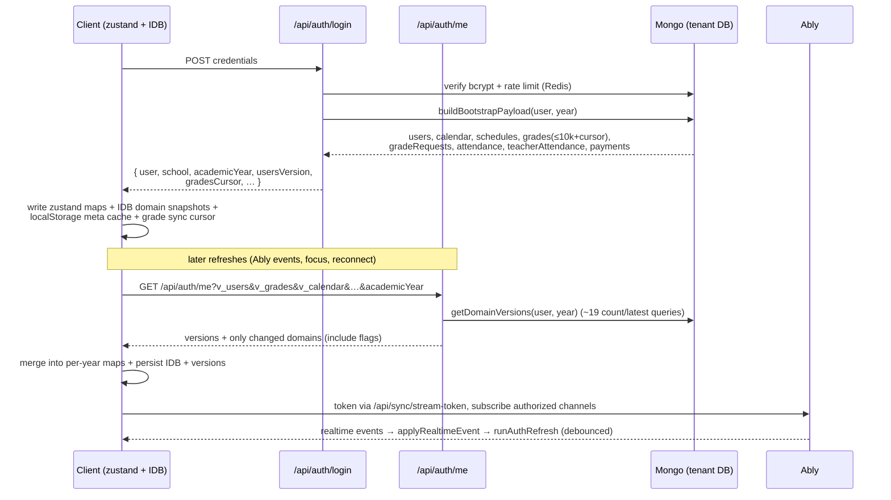
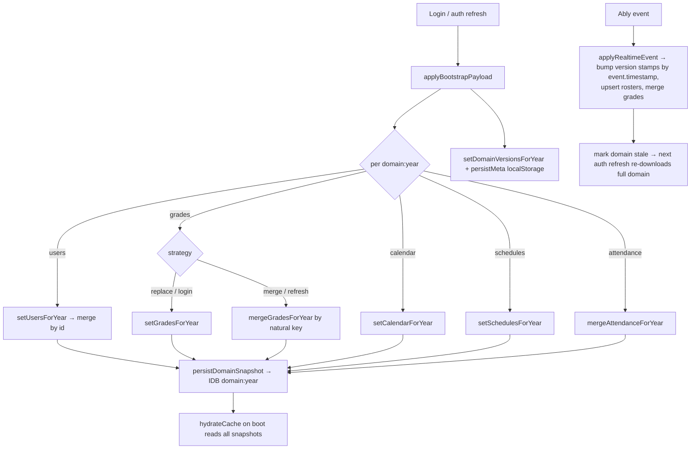
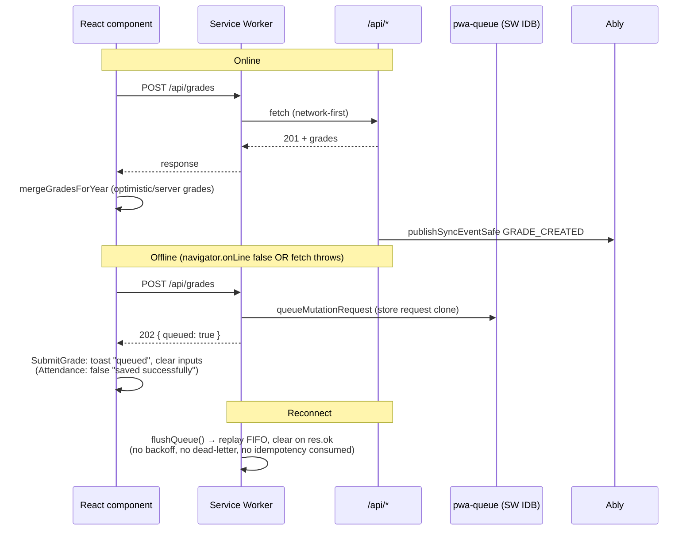
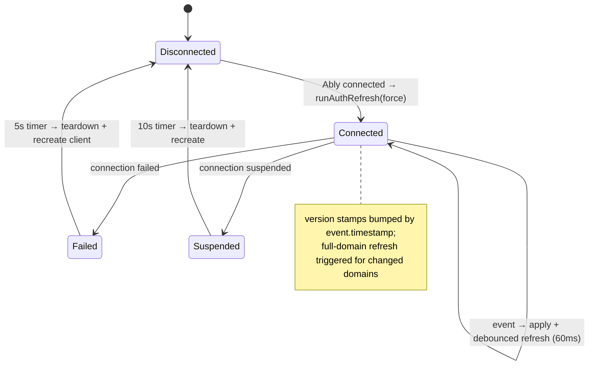
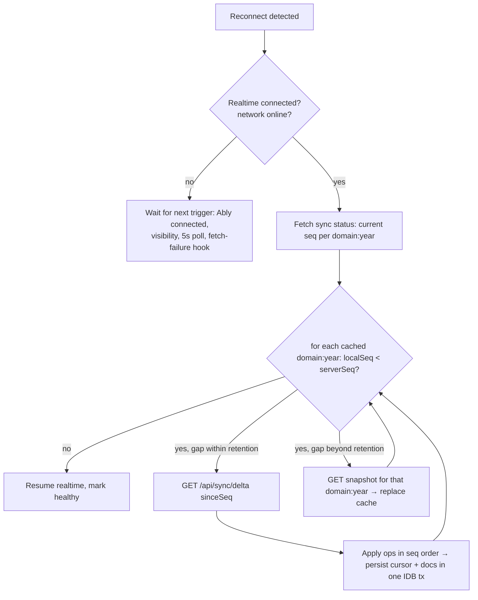

# SchoolMesh Synchronization Architecture Review & Evolution Plan

**Status:** Design document (no code changes required by this document)
**Scope:** Bootstrap, IndexedDB cache, Ably realtime, offline queue, versioning, delta sync, conflict resolution, observability
**Constraint fidelity:** Keeps IndexedDB, Ably, offline-first philosophy, academic-year partitioning, and role-scoped bootstrap. Favors incremental evolution over rewrites.

---

## 1. Executive Summary

SchoolMesh has already made the architecturally correct bet: **the browser is a local database, the server is the synchronization authority, and realtime events keep the local cache fresh.** The version-negotiated bootstrap (`/api/auth/me?v_*`), academic-year partitioning, role-scoped queries, natural-key merge semantics, and service-worker mutation queue are all sound foundations.

However, the current implementation couples **transport** (Ably + HTTP) directly to **state** (zustand → IndexedDB) without an intermediate **change-tracking layer**. There is no append-only change log, no monotonic sequence numbers, and no client-side sequence cursor. Version tokens are content-derived fingerprints (`count:latestTimestamp:latestId`) that cannot represent deletes or reorderings reliably. This produces the core set of weaknesses: missed realtime events are only healed by full-domain re-downloads, offline mutations are not idempotent server-side, multi-tab operation is unsafe, and there is no conflict resolution beyond silent last-write-wins.

This document proposes an **event-log + monotonic-sequence + delta-sync engine** that sits *behind* the existing interfaces — the same payloads, the same channels, the same IndexedDB partitions — so it can be introduced incrementally without a rewrite.

---

## 2. Current Architecture (As-Built)

### 2.1 System Overview

```
┌────────────────────────────────────────────────────────────────────────┐
│  Browser (per tenant school)                                           │
│                                                                        │
│  React components                                                      │
│        │ reads                                                        │
│        ▼                                                               │
│  Zustand stores (useSchoolStore / useAuth / useNetworkStore)           │
│        │ hydrate / persist (fire-and-forget)                          │
│        ▼                                                               │
│  IndexedDB  school-domain-cache (domains, key = domain:academicYear)   │
│  localStorage  school-cache-v2 (versions), auth-user, grade cursors    │
│        │                                                              │
│  Service Worker  sw.js  (static/api/runtime caches + pwa-queue IDB)    │
└───────────────┬────────────────────────────────────────────────────────┘
                │ HTTPS (fetch) / Ably WebSocket
┌───────────────▼────────────────────────────────────────────────────────┐
│  Next.js API (multi-tenant Mongo, one DB per school)                   │
│   /api/auth/login · /api/auth/me (bootstrap + version diff)            │
│   /api/sync/grades (cursor/skip chunked)                               │
│   /api/sync/stream-token (Ably token)                                  │
│   mutation routes: /api/grades /api/attendance /api/users /api/school… │
│   publishRealtimeEvent (lib/ablyServer.ts) via Ably REST               │
└───────────────┬────────────────────────────────────────────────────────┘
                │ Ably REST publish
                ▼
┌────────────────────────────────────────────────────────────────────────┐
│  Ably Realtime  (school:{tenant} · class:{tenant}:{class} ·            │
│                  user:{tenant}:{user} · superadmin:broadcast ·         │
│                  platform:events)                                      │
└────────────────────────────────────────────────────────────────────────┘
```

### 2.2 Login & Bootstrap Flow



Key files: `lib/bootstrap.ts` (payload + version builders), `app/api/auth/login/route.ts`, `app/api/auth/me/route.ts`, `store/useAuth.ts` (`checkAuthStatus`, `applyBootstrapPayload`), `store/schoolStore.ts` (`hydrateCache`, `applyRealtimeEvent`).

### 2.3 Cache Population & Invalidation



Invalidation is **whole-domain**: any Ably event for a domain bumps that domain's version stamp (`event.timestamp`), and the next `/api/auth/me` call re-sends the **entire** domain because the stamp no longer equals the server token.

### 2.4 Mutation Flow (Online + Offline)



### 2.5 Realtime & Reconnection



### 2.6 Offline→Online Pipeline (`RootProviders.tsx`)

```mermaid
flowchart TD
    A[offline→online OR boot online] --> P1[Phase 1: connectivity probe + checkAuthStatus]
    P1 --> P2[Phase 2: replay legacy localStorage offline queue (dead code)]
    P2 --> P3[Phase 3: postMessage flush-grade-queue to SW<br/>ONLY if hasAppsFeature flag enabled]
    P3 --> P4[Phase 4: fetchSchool + runBackgroundGradeSync<br/>if pending cursor remaining]
```

### 2.7 Academic Year Partitioning

- **IndexedDB:** one `domains` store; record key `` `${domain}:${academicYear}` ``, fields `{ domain, academicYear, value, updatedAt }` (`utils/domainSyncCache.ts:40`).
- **Zustand:** per-year maps (`usersByAcademicYear`, `gradesByAcademicYear`, …) resolved with `getScopedAcademicYearValue` / `assignAcademicYearRecord` which expand key variants (`2026-2027` / `2026/2027` / normalized).
- **Grade cursor:** `localStorage sync_cursor_grades_${academicYear}`.
- **Version metadata:** `localStorage school-cache-v2` holds per-year version maps.
- **Server:** every query is `{ academicYear: <filter>, …roleScope }`; `UserSyncState` is per-year.

---

## 3. Strengths (Keep These)

1. **Version-negotiated bootstrap already exists.** `/api/auth/me` diffs client `v_*` tokens against server-computed versions and omits unchanged domains. This is the correct shape for delta sync — it needs a better *token*, not a different *architecture*.
2. **Academic-year partitioning is pervasive and correct.** Keys, cursors, version maps, queries, and realtime payloads all carry `academicYear`. Switching years is isolated server-side by `resolveAcademicYearAccessContext`.
3. **Role-scoping is centralized** in `lib/bootstrap.ts` (`getRoleGradesQuery`, `getRoleAttendanceQuery`, `getRoleUsersQuery`, …). One place to audit, one place to harden.
4. **Natural-key merges are idempotent.** `getGradeIdentity` (`academicYear|classId|subject|period|studentId|teacherUsername`) means optimistic `Pending` grades are replaced by server docs on merge, and repeated event application converges (`store/schoolStore.ts:313`). This is a poor-man's CRDT-friendly merge and is worth preserving.
5. **Service worker is genuinely network-first for API, cache-first for static** (`public/sw.js`), giving a real offline shell + offline fallback page.
6. **Connectivity state machine has hysteresis** (3 consecutive successes/failures, 8s stuck-check) preventing flapping (`store/networkStore.ts`).
7. **Reentrancy guards are disciplined:** `gradeSyncInProgress` set, `fetchPromise`, `authRefreshInFlight`, `authCheckPromise`, `AUTH_CHECK_DEDUP_MS`. No unbounded concurrent duplicate fetches within a tab.
8. **Optimistic grade submission with queued-detection** (`SubmitGrade.tsx` handles `data?.queued`) is the right UX pattern.
9. **Redis-backed sessions with host binding** (`lib/auth.ts`), per-role Ably capability grants, and rate limiting on login are solid security foundations.
10. **Grades already have a dedicated chunked sync endpoint** (`/api/sync/grades`, cursor + skip). The pattern to generalize.

---

## 4. Weaknesses

Severity: **P0** = data loss / stale data / blocks scale · **P1** = correctness or resilience risk · **P2** = hygiene / observability.

### 4.1 Version tokens cannot represent change (P0)

`lib/bootstrap.ts:18-29` `toHash` is a 31-bit multiply-add hash. Domain tokens are `count:latestTimestamp:latestId` (`getDomainVersions`, lines 743-911).

- `count` doesn't capture **deletes** (a delete that swaps one doc for another keeps count equal).
- `latestTimestamp` misses updates to **old** documents (editing a grade created in September, when today is June: `lastUpdated` becomes newer so this works — but a *touch* that re-saves a doc without changing data, or a document whose updateTimestamp is older than the current latest, is invisible).
- `latestId` breaks ordering guarantees (ObjectId is time-ordered only within a process).
- The 31-bit hash collides at scale; `toHash(currentUser)` for `v_user` can produce a false match → client skips a user payload it actually needs.

Consequence: the client and server can disagree about whether a domain is current, yielding **stale caches that never heal** until a forced reload, or the opposite — permanent full-domain re-downloads.

### 4.2 No change log / event store (P0)

Every write path calls `publishSyncEventSafe` (fire-and-forget, `lib/ablyServer.ts:90-117`) and bumps a counter, but **nothing persists the change**. There is no way to:

- Replay events a client missed (only option: full-domain re-download via version diff).
- Guarantee event delivery (publish failures are swallowed; `publishSyncEventSafe` catches and warns).
- Represent deletes to offline clients (no tombstones; `Grade.deleteMany` at `app/api/grades/route.ts:1746` has no event-logged counterpart).
- Order realtime events (Ably preserves per-channel order, but events for the same document published across different channels can interleave, and `timestamp` is generated client-of-server-clock).

### 4.3 No idempotency at the server (P0)

The SW queue replays POSTs; `RootProviders` injects `X-Offline-Sync-Id` / `X-Offline-Timestamp` (`RootProviders.tsx:199`) "for server-side idempotency handling," but **no route reads these headers** (verified by grep). The grade POST already dedups via the `409`/`submissionId` checks (`app/api/grades/route.ts:1392-1415`), which *accidentally* provides at-least-once behavior for grades, but:

- A replay that raced past the first response and hits 409 leaves the queued item **retried forever** (`flushQueue` keeps non-2xx items, `sw.js:135-141`).
- Attendance, users, schedules, etc. have no such dedup — **double-apply on replay**.
- No dead-letter queue, no max-attempts, no backoff.

### 4.4 Multi-tab is unsafe (P0)

Confirmed: **no BroadcastChannel, no SharedWorker, no `storage` listeners** anywhere. Two tabs on the same school will:

- Each run the 4-phase sync pipeline concurrently (`RootProviders` `isSyncing` guard is per-tab).
- Each subscribe to Ably and apply the same event twice (the merges are idempotent, but version stamps are set to `event.timestamp`, so the two tabs can store different stamp strings for the same change → one tab refetches redundantly).
- Each call `flush-grade-queue`, racing the shared SW queue.
- Concurrently write the same IndexedDB `domain:year` records and localStorage cursors — **last-writer-wins on the whole value**, so a tab with an older snapshot can clobber a newer one.
- Each run `/api/auth/me` simultaneously, multiplying DB load.

### 4.5 Client version stamps are timestamps, not sequences (P1)

`store/schoolStore.ts:1040` sets the domain version stamp to `event.timestamp` (an ISO string). Two events in the same millisecond, or any clock skew, can produce stamps that compare **less than** the previous stamp → the client keeps telling the server it's behind even though it applied everything, or vice-versa. Version comparison is string equality, so "stale" is a binary, not a delta — there is no notion of *how far behind*.

### 4.6 Whole-domain refresh on any change; no delta for most domains (P1)

Only `grades` has a real delta path. `attendance`, `calendar`, `schedules`, `gradeRequests`, `users` are re-downloaded **entirely** whenever their version differs. With a 5,000-student school, a single attendance record edit re-downloads the whole year's attendance; a single roster edit re-downloads up to 5,000 users.

### 4.7 Users bootstrap is capped with no cursor (P1)

`MAX_BOOTSTRAP_USERS = 5000` (`lib/bootstrap.ts:16`) with **no `usersCursor`** and no users sync route. A school exceeding 5,000 users silently truncates the roster on login; there is no mechanism to fetch the remainder.

### 4.8 Skip-based parallel grade sync is O(n) and racy (P2)

`/api/sync/grades` parallel mode uses `.skip(skip)` on a collection sorted by `lastUpdated` (`app/api/sync/grades/route.ts:47-69`). `skip` is O(n) in Mongo, and because the sort key is mutable, **new grades with older `lastUpdated` shift offsets mid-sync**, producing duplicates or omissions in parallel chunks. The cursor (keyset) mode is correct; the parallel mode is the problematic one.

### 4.9 IndexedDB value limits and single-value-per-domain design (P1)

Each domain:year is stored as **one array in one record** (`setDomainSnapshot`). A year with ~1M attendance rows (5,000 students × 200 days) in a single structured-clone `put` risks quota errors and slow reads. `getAllDomainSnapshots` reads every domain:year at once on hydrate. Writes are fire-and-forget (`persistDomainSnapshot` `void …catch`), so a tab closed mid-write silently loses the snapshot. `clearCache`/`clearDomainSnapshots` wipes **all years** even when only one year changed.

### 4.10 Manual user-version bumping is incomplete (P1)

`bumpUsersVersion` is hand-called at ~12 sites in `app/api/users/route.ts` and `app/api/school/route.ts`. Any mutation path that forgets the bump (profile edits, parent child-switch, notifications read-state, future routes) leaves the `users` domain permanently stale without any automatic signal.

### 4.11 Offline UX inconsistencies (P1)

- `Attendance.tsx` treats the SW `202 {queued:true}` as plain success ("saved successfully") with no optimistic merge and no "queued" toast (unlike `SubmitGrade`).
- The SW flush is **gated behind the `hasAppsFeature` school flag** (`RootProviders.tsx:31,261`) — schools without the flag never flush queued mutations.
- The flush `postMessage` result is never handled, so replay completion/failures are invisible.
- The legacy `school_portal_offline_requests` queue is **dead** (no writer remains) yet the pipeline still "replays" it — dead code that can only confuse.

### 4.12 Server cost per refresh (P1)

`getDomainVersions` issues ~19 `countDocuments`/`findOne` queries, and every Ably event triggers a debounced `/api/auth/me` (60ms). At thousands of concurrent users, each issuing version-diff requests and 19 queries, this will not scale without indexes/caching or sequence counters.

### 4.13 Session expiry is fixed at 1 day, no sliding renewal (P2)

`utils/session.ts: SESSION_EXPIRY = 60*60*24`; sessions never extend. Users are silently logged out mid-day on the 24h mark.

### 4.14 Observability is minimal (P2)

`lib/syncDebug.ts` is `SYNC_DEBUG_LOGS`-gated console logging. There are no metrics for cache hit ratio, sync duration, delta sizes, reconnect frequency, conflict counts, or IDB usage. Sentry captures errors only.

### 4.15 Duplicated version helpers (P2)

`toHash`/`toSchoolVersion` are copy-pasted in `lib/bootstrap.ts`, `app/api/auth/login/route.ts:20-41`, and `app/api/auth/me/route.ts:31-52`. A change to the hash scheme must be made in three places or the client/server diverge.

---

## 5. Failure Scenario Analysis

Assessment: ✅ correct today · ⚠️ mostly correct, with a gap · ❌ incorrect.

| Scenario | Behavior today | Verdict |
|---|---|---|
| **User loses internet mid-update** | SW `fetch().catch` queues the mutation; grade UI shows "queued"; other flows may misreport success. On reconnect, FIFO flush. | ⚠️ Queueing works; but no idempotency → double-apply risk for non-grade endpoints; no backoff/dead-letter. |
| **Ably disconnects** | `failed` → 5s teardown/recreate; `suspended` → 10s. On `connected`, forced `runAuthRefresh` re-runs version diff. | ⚠️ Recovers, but *only* by full-domain re-download of every changed domain (grades re-fetch if stamp differs); events during the gap are not replayed individually; a silent `disconnect` (mobile radio off, no `failed` event) relies on the 5s network poll + visibility. |
| **Browser sleeps / laptop resumes** | Timers paused; on resume, `visibilitychange` fires → `refreshConnectivity` → pipeline; Ably may have timed out and reconnects → forced refresh. | ✅ Good recovery path; inefficient (full refresh) but correct. |
| **Two teachers edit the same grade** | Both POST; second one hits `409` (non-Rejected existing grade) or overwrites via `findOneAndUpdate` PUT. | ❌ No lost-update detection for the *second* legitimate edit; server silently last-write-wins; no conflict surfaced. |
| **Admin changes a student while a teacher edits attendance** | Both publish Ably events; clients merge. Admin's user event triggers roster upsert + `runAuthRefresh`; teacher's attendance merges. | ⚠️ Converges because merges are keyed and refresh re-downloads domains; but ordering is not guaranteed and the *intersection* (student's class changed → old attendance rows) can momentarily show wrong data until the next full refresh. |
| **Mobile reconnects after hours offline** | Pipeline runs: auth refresh (full domain diff) + grade cursor sync. Queued mutations flushed FIFO. | ⚠️ Works but heavy (full re-downloads) and queue can be blocked forever by one permanent-failure entry. No "conflict detected" UX. |
| **Two tabs open** | No coordination. Both run pipeline, both apply Ably events, both flush the SW queue, both write the same IDB records. | ❌ Correctness is only saved by idempotent merges; cursor/queue/IDB writes race; duplicate API work. |
| **Login on two devices** | Both devices pull the same bootstrap; Ably channels are per-user/school so both receive events; sessions are separate Redis entries. | ✅ Multi-device basically works today *because* the server is the authority and events fan out. Weakness: no per-device outbox state and conflicts are silent LWW. |

**Bottom line:** the system converges in most scenarios because (a) merges are natural-key idempotent, and (b) version diff forces eventual full refresh. It is **correct-but-inefficient and conflict-blind**. The evolution plan fixes the efficiency and the blindness without changing those two winning properties.

---

## 6. Next-Generation Synchronization Engine

### 6.1 Design Principles

1. **The server is the single authority; clients are replicas.** No multi-master. All ordering derives from server-assigned sequence numbers.
2. **Every change is a logged, sequence-numbered operation.** Realtime, delta sync, and version negotiation all read from the same event log. One source of truth.
3. **Clients track a cursor, not a fingerprint.** "I have applied through sequence 421 for `grades/2026-2027`" replaces "my hash of grades/2026-2027 is X".
4. **Deltas are the default; snapshots are the fallback.** Full downloads only when a client is too far behind or a domain is small.
5. **Mutations are idempotent and version-checked.** Retry is safe; concurrent edits are detected, not silently overwritten.
6. **Incremental, backwards-compatible evolution.** The old fingerprint path and the new sequence path coexist during migration.

### 6.2 Versioning Strategy

The question: version number vs. sequence number vs. timestamp vs. vector clock vs. change token.

**Recommendation: monotonically increasing sequence number per (tenant, domain, academicYear), published as a change token.** Rationale:

| Mechanism | Fit for SchoolMesh |
|---|---|
| `version` (integer counter) | Good but must be incremented atomically per mutation; today's `UserSyncState.version` is exactly this for `users`, and it works — but it is a *single* counter, so it can't represent "which records changed". Use it, but make it the tail of the event log, not a hand-bumped value. |
| `sequence number` per event | **Primary recommendation.** Server assigns `seq = counter.next()` inside the same transaction as the write. Monotonic, dense, comparable, and each value corresponds to exactly one logged operation. This is what makes delta sync trivial ("give me ops 422–435"). |
| `timestamp` | Rejected as the ordering authority: clock skew, same-ms collisions (already a live bug at `schoolStore.ts:1040`), non-dense gaps. Keep timestamps as *metadata* on events, never as the sync cursor. |
| `vector clock` | Rejected as the primary mechanism: overkill for a single-authority system, and vectors must be trimmed or they grow unboundedly. A **Lamport-style per-domain sequence** gives the same causality guarantees for a single writer. Introduce per-field/writer causality only if SchoolMesh ever becomes multi-master. |
| `change token` | This is the **wire format**: the client sends/receives `{ domain, academicYear, seq }` tokens instead of raw numbers, so the protocol can evolve the underlying counter independently. |

Concrete per-collection choice:

- Every mutable collection in a tenant DB gets a **`sync` metadata block** on each document: `{ seq, actorId, at }` (the seq of the change that produced the current revision).
- Every (domain, year) has a **`SyncSequence` document** holding `{ domain, academicYear, seq }`, advanced with `findOneAndUpdate({$inc:{seq:1}}, {upsert:true, new:true})` **inside the same transaction** as the document write (Mongo 4.4+ supports multi-document transactions on replica sets; if the deployment is a standalone, use `$inc` on a single doc as the atomic counter, which is sufficient for a single authority).
- The domain-level change token is `{ domain, academicYear, seq }`; the client stores the last applied `seq` per domain:year.

Why not a vector clock: SchoolMesh is single-authority; a per-domain Lamport sequence is simpler, cheaper, and sufficient. Keep a place in the event schema (`causality: { writerId, counter }`) so a future multi-master upgrade does not require a schema break.

### 6.3 Delta Synchronization Protocol

```
Client:  "I have applied through seq 421 for grades/2026-2027."
Server:  "Apply operations 422..435." (each op = {seq, op, docId, doc})
Client:  applies in order → advances cursor to 435 → resumes realtime
```

**Endpoint:**

```
GET /api/sync/delta?domain=grades&academicYear=2026-2027&sinceSeq=421&limit=1000
→ 200 { ops: ChangeOp[], nextSeq: 435, hasMore: true }
   { seq, op: "upsert"|"delete", docId, doc?: {...}, actorId?, at?, hash? }

GET /api/sync/status   (or fold into /api/auth/me versions)
→ { domain: { academicYear: { seq } } ... }   // server's current seq per domain:year
```

**ChangeOp semantics:**
- `upsert`: full current document (not a field patch). Simple, safe, and the natural-key merge already tolerates full docs. Field-level patches can be added later as an optimization (they break idempotent replay).
- `delete`: tombstone. The document carries `deletedAt` and a final `seq`; it is *not* physically removed until retention cleanup. Offline clients learn of deletes by applying the tombstone.

**Client apply rules:**
- Ops are applied **strictly in seq order**, buffering any that arrive out of order (realtime can deliver an event for seq 435 before the delta for 422..434 completes).
- Applying is idempotent: for `upsert`, insert/replace by `docId`; for `delete`, remove or mark tombstone.
- After applying through `nextSeq`, the client persists cursor `{ domain, academicYear, seq: nextSeq }` **in the same IndexedDB transaction** as the doc writes.
- If `sinceSeq` falls before the retention window, the server responds `{ needsSnapshot: true }` and the client falls back to `GET /api/sync/snapshot/{domain}?academicYear=…` (see §6.5).

### 6.4 Event Log

**Yes — the server should maintain an append-only change log.** It is the foundation that makes replay, audit, deltas, and recovery all simple.

```ts
// New per-tenant collection: ChangeLog
{
  _id: ObjectId,
  domain: "grades",                       // indexed, part of compound key
  academicYear: "2026-2027",              // indexed, part of compound key
  seq: 435,                               // unique within (domain, academicYear)
  op: "upsert" | "delete",
  docId: "…",                             // logical id (studentId+period+subject or _id)
  doc: { … },                             // full doc for upsert; null for delete
  hash: "sha256:…",                       // digest of doc for integrity checks
  actorId: "…",
  at: ISODate,
  causality: { writerId: "…", counter: 0 } // reserved for future multi-writer
}
// unique compound index: { domain:1, academicYear:1, seq:1 }
// supporting index: { domain:1, academicYear:1, at:1 }
```

**Retention & pruning:**
- Default hot window: **60 days** (configurable per domain). Within the window, clients can delta-replay from any `sinceSeq`.
- Prune with a background job (existing cron infra: `app/api/cron/monitoring`) that removes `ChangeLog` rows older than the window, then writes a **compaction snapshot** for each (domain, year): `SnapshotRecord { domain, academicYear, seq, checksum, docsHash, createdAt }` stored in a `DomainSnapshot` collection (or R2 for very large domains). A client that needs `sinceSeq` older than the window is pointed at the snapshot and told to re-apply any newer ops from the tail of the log.
- Bounded replay: delta requests default to `limit=1000`, paginated by `nextSeq`.

**Replay & pagination:** `GET /api/sync/delta` supports `cursor = sinceSeq` and returns `nextSeq` for the next page; a `fromSnapshot=1` flag tells the server to walk the snapshot+tail combination.

### 6.5 Reconciliation (Reconnect Behavior)



**Realtime ordering rule:** realtime events carry `seq`. While a delta pull for the same (domain, year) is in flight, incoming realtime events are **buffered and applied only after the delta has caught up to their seq**, guaranteeing no out-of-order application and no missed event.

**Idempotent realtime application:** the client keeps an LRU "last applied event seqs" set per (domain, year) and skips events already applied by a delta pull, so the realtime and delta paths never double-apply the same change.

### 6.6 Conflict Resolution

1. **Server-authority LWW by seq (default).** The revision with the higher `seq` wins. Deterministic, matches the single-authority model, and the existing natural-key merge makes it convergent.
2. **Optimistic concurrency for interactive edits (grades, attendance, grade requests, users).** Mutation requests include `expectedSeq` (the client's last-known seq for the target record). The server compares against the record's current `seq`:
   - Match → apply, return new seq.
   - Mismatch → **409** with `{ currentDoc, currentSeq }`. Client surfaces "This record changed while you were editing" and offers: *reload my changes on top*, *discard mine*, or *route through the existing grade-change-request workflow* (a natural SchoolMesh merge path for grades).
3. **No blind whole-document overwrites.** PUT/PATCH must carry `expectedSeq` or the specific field set; the server rejects stale full-document replaces.
4. **Independent-field merges** (e.g., a teacher edits `score` while an admin edits `status`) can be merged per-field: if the two updates touch disjoint field sets, apply both; if overlapping, LWW by seq. This is cheap to implement since the event log already stores full docs — compute the merge on the server from the two logged revisions.
5. **User/roster conflicts** are server-authority; the manual `bumpUsersVersion` is replaced by automatic event-logging, so every user mutation bumps `users/<year>` seq exactly once.

### 6.7 Offline Queue Redesign

Replace the two current queues (dead localStorage queue + raw SW `pwa-queue`) with **one outbox in IndexedDB**, owned by the page (with the SW as the *fallback* capture point when the page is closed):

```ts
// Outbox entry
{
  id: "uuid",                // stable idempotency key, generated once
  url, method, headers, body,
  idempotencyKey: "uuid",
  expectedSeq?: number,      // for optimistic concurrency on replay
  createdAt, attemptCount, maxAttempts: 8,
  nextRetryAt, lastError,
  status: "pending" | "in-flight" | "dead" | "done",
  order: 12345               // global monotonic per tab-session, for FIFO
}
```

- **Idempotency (server side):** every mutation route checks `Idempotency-Key` header against an `IdempotencyRecord` (Redis with TTL, or Mongo `{ key, response, seq }`). On replay, return the stored response (including the returned doc + seq) instead of re-executing. This closes §4.3. Keys are generated by the client **once** and reused across retries.
- **Retry/backoff:** exponential backoff with jitter (1s, 2s, 4s, …, cap 5min), respecting `nextRetryAt`; the flush loop re-enters only when online and at least one entry is due.
- **Dedup/ordering:** strict FIFO by `order` for mutations that touch the same domain+record (compute a `resourceKey` from `url`+`body.docId`); independent records may flush in parallel.
- **Dead-letter:** after `maxAttempts`, mark `dead` and surface in a "Pending changes" UI (do not silently drop, do not block the rest of the queue).
- **Triggers:** `navigator.sync.register('schoolmesh-outbox')` when available (Background Sync API) + Ably `connected` + connectivity poll + a fetch-failure hook. The flush runs in the **leader tab** only (§6.9).
- **Flush result feedback:** the leader posts the outcome to a BroadcastChannel so all tabs and the UI can update a shared "syncing / N pending / conflict on X" indicator. The `hasAppsFeature` gate on flushing (§4.11) is removed — queue flushing is core infrastructure, not a feature flag.
- **On session invalid / logout:** outbox is cleared only for the current user; entries carry `tenantId`+`userId` and are filtered, not globally wiped.

### 6.8 Multi-Device Synchronization

- Devices need no device-specific state. Each device has its own outbox + its own per-domain:year cursor.
- Convergence is guaranteed by (a) server-assigned seq ordering, (b) delta pull on reconnect, (c) idempotent replay, (d) natural-key merges.
- Conflicts between two devices editing the same record are resolved by §6.6 (409 + reconcile UX), not silently.
- The existing per-user `user:` channels already deliver personal events to all devices of a user; the event log makes the *catch-up* for a device that was offline work the same way on phone, tablet, or laptop.

### 6.9 Multi-Tab Synchronization

**Recommendation: `BroadcastChannel` + leader election.** Rationale vs. alternatives:

| Option | Verdict |
|---|---|
| `BroadcastChannel` | **Primary.** Simple, works on all modern browsers, no extra worker. Used for: event-dedup gossip, outbox-change notification, sync-pipeline lifecycle, cursor updates. |
| `SharedWorker` (single Ably connection) | Attractive (one socket) but adds a long-lived worker that must own all queue/IDB logic, complicates HMR/dev, and is not available in all WebViews. Rejected as primary; can be a later optimization. |
| Leader election in the tab (via `BroadcastChannel` "take the crown") | Each tab **still keeps its own Ably connection** (Ably handles many connections fine; per-connection recovery is simpler than one shared socket). The leader exclusively owns: running the 4-phase sync pipeline, flushing the outbox, and executing background grade sync. Followers are pure readers + UI. |
| Locks via `navigator.locks` | Use as a low-level mutex around IndexedDB writes if leader-election alone proves insufficient. |

Concrete rules:
1. On tab open, join channel `schoolmesh-sync:{tenantId}`. Leader is the oldest tab with a heartbeat (heartbeat every 5s; followers take over when the leader's heartbeat stops).
2. **Ably events are applied by every tab** (each has its own socket) but **deduped** by `event.seq` against the shared "applied seq" LRU in IndexedDB + an in-memory set gossiped via BroadcastChannel. This keeps per-tab responsiveness without double-application.
3. **IndexedDB writes are serialized** through the leader for snapshot/cursor records, or wrapped in `navigator.locks.request('schoolmesh-idb', …)`. All writers must pass through the lock so two tabs can't interleave a `domain:year` replace.
4. **The outbox and cursor** are shared records in IDB; the leader is the only flusher, so the SW queue is drained once.
5. `storage` events are a fallback channel for browsers without BroadcastChannel (Safari < 15.4).

### 6.10 Academic Year Synchronization

- The event log is partitioned by `academicYear`, so syncing `2026-2027` never touches `2025-2026`.
- Cursors are per (domain, year); switching years just changes which cursors the sync engine reconciles.
- `clearCache` becomes **year-scoped** (delete only the target year's records + cursors), so clearing a switch target never invalidates unrelated years (§4.9).
- Realtime events already carry `academicYear`; the sync engine routes them only to the matching year partition.
- Background loading: when a user selects a new year, the engine fetches a snapshot or delta for that year only, in the background, while the current year's UI keeps rendering.

### 6.11 Bootstrap Evolution

Keep the bootstrap as the **first-load skeleton**, but split it into: fast, version-negotiated baseline + background loading for large domains.

```mermaid
flowchart LR
    L[Login] --> B1[Bootstrap v1: user + school + meta<br/>+ versions + small domains<br/>(calendar, schedules, gradeRequests)]
    B1 --> B2[Version negotiation: client sends cursors]
    B2 --> B3[Delta sync: grades/users/attendance<br/>streamed via /api/sync/delta or snapshot,<br/>background, chunked]
    B3 --> RL[Resume realtime, background-load remainder]
```

- `school`, `user`, `calendar`, `schedules`, `gradeRequests`, `teacherAttendance` stay in bootstrap (small, role-scoped).
- `grades` (>10k rows) and `users` (>5k) become **snapshot-with-cursor** or **delta** loads: bootstrap returns the first chunk + cursor (grades already does this) and the engine streams the rest in the background without blocking render.
- `attendance` (largest risk) becomes **lazy**: load the current month/day range first, backfill on demand + cursor sync.
- The 5,000-user cap gains a `usersCursor` + `/api/sync/users` delta endpoint so no roster is ever truncated.

### 6.12 Data Integrity

1. **Per-document digest:** every `upsert` op carries `hash = sha256(canonical(doc))` (canonical: sorted keys, omit `hash`/`seq`). The client stores `doc.seq` + `doc.hash` alongside each cached record.
2. **On hydrate / periodically (idle), verify:** recompute the hash of local records; any mismatch → mark that (domain, year) dirty → refetch via delta or snapshot. Keeps corruption self-healing.
3. **Snapshot checksums:** snapshot endpoints return `checksum = sha256(concat(docs))`; the client verifies before replacing the cache.
4. **Write-then-verify:** after a large IDB transaction, read back the record count/checksum; on mismatch, drop and refetch.
5. **Cache corruption detection:** `school-domain-cache` moves to **v2** with a schema version + per-record integrity wrapper (see §8); hydration validates the version and drops mismatched records.

### 6.13 Recovery

| Event | Recovery mechanism |
|---|---|
| Missed Ably event | Realtime events carry `seq`; gap vs. cursor → delta pull (§6.5). |
| Expired event log | `needsSnapshot` → snapshot + tail replay (§6.4). |
| Server restart | `ChangeLog` + `SyncSequence` are durable Mongo docs; seqs stay monotonic across restarts (`$inc` atomic counter). Mutations already committed are logged; uncommitted are retried idempotently. |
| Browser crash mid-write | IDB transactions are atomic; the cursor and doc writes commit together or not at all. On next boot, reconcile cursors. |
| IndexedDB corruption | Schema/checksum validation on hydrate → refetch affected domain:year. |
| Partial snapshot write | Snapshot replaced in a single transaction + verified by checksum. |
| Lost response after server commit | Client retries with the same `Idempotency-Key` → server returns the stored response, no double-apply. |
| Stale `session-present` cookie offline | Existing behavior kept (offline read is intentional); online re-validation remains the authority. Consider adding an offline grace check against local "last good sync time". |

### 6.14 Observability

Instrument both client and server. The app already has `lib/observability/*` + `/api/observability/client-error` + an admin monitoring dashboard — extend it.

**Client metrics** (reported on sync events, sampled ~1/10 to bound traffic, via `/api/observability/sync-metrics`):
- `sync.duration_ms` (pipeline, per phase)
- `sync.delta.ops`, `sync.delta.bytes`, `sync.snapshot.bytes`
- `sync.cache.hit_rate` per domain (component reads served from cache vs. fetch)
- `sync.reconnect.count`, `sync.missed_event_recovery.count` (gaps healed)
- `sync.conflict.count`, `sync.outbox.pending`, `sync.outbox.dead`
- `sync.bootstrap.bytes`, `sync.first_paint_ms`
- `storage.indexeddb.usage_bytes` (`navigator.storage.estimate()`), per-domain record counts

**Server metrics**:
- `seq` watermarks per (tenant, domain, year)
- `sync.delta.latency`, `sync.delta.ops.served`
- `eventlog.size`, `eventlog.pruned`
- mutation conflict rate (409s by route)
- `auth.me` request rate + query count per request (today ~19; target: 1–2 via `SyncSequence` reads)

**Traceability:** each sync request carries `X-Sync-Trigger` (already partially present as `sync_trigger`) + `X-Trace-Id`; Sentry spans link to Ably publish and delta pulls.

---

## 7. Database Schema Changes

Per **tenant** database (all new collections indexed for the hot paths):

```ts
// 1. ChangeLog — the append-only event log (see §6.4)
ChangeLog {
  _id, domain, academicYear, seq, op: "upsert"|"delete",
  docId, doc?, hash, actorId, at, causality
}
// unique index (domain, academicYear, seq)

// 2. SyncSequence — per (domain, academicYear) monotonic counter
SyncSequence { domain, academicYear, seq }
// unique index (domain, academicYear); advanced atomically with $inc in the
// same transaction as the write; generalizes the existing UserSyncState.

// 3. DomainSnapshot — compaction artifacts for retention pruning
DomainSnapshot { domain, academicYear, seq, checksum, docCount, createdAt }

// 4. IdempotencyRecord — dedupe for offline replays
IdempotencyRecord { key, route, statusCode, response, seq, expiresAt }
// TTL index on expiresAt (or Redis equivalent)
```

**Document-level additions on existing collections** (Grade, Attendance, TeacherAttendance, Payment, SchoolEvent, User, GradeChangeRequest):
```ts
{
  seq: number,          // last applied change seq (set by the writer)
  deletedAt?: Date,     // tombstone flag (replaces hard deletes for syncable docs)
}
```
Migration: backfill `seq = 0` and set `deletedAt: null` for existing docs; the first post-migration write assigns the first real seq. Existing `UserSyncState` can either remain as-is for `users` or be replaced by a `SyncSequence` row `{ domain:'users', academicYear, seq }` — recommend the latter, with a one-time data migration, because it removes the hand-bumping burden (§4.10).

---

## 8. API Changes

**New endpoints:**
- `GET /api/sync/delta?domain&academicYear&sinceSeq&limit` → `{ ops, nextSeq, hasMore, needsSnapshot? }`
- `GET /api/sync/snapshot/{domain}?academicYear` → `{ docs, checksum, seq }` (large domains chunked/compressed; optionally served from R2)
- `GET /api/sync/users?academicYear&cursor` → paginated roster (mirrors `/api/sync/grades`)
- `POST /api/observability/sync-metrics` (sampled client metrics)

**Modified endpoints:**
- **All mutation routes** (`/api/grades`, `/api/attendance`, `/api/teacher-attendance`, `/api/users`, `/api/school`, `/api/schedules`, `/api/calendar`, `/api/grades/requests`, `/api/notifications`):
  - Accept `Idempotency-Key` header → check/write `IdempotencyRecord`.
  - Accept `expectedSeq` (or `If-Match`-style) → 409 on conflict with `{ currentDoc, currentSeq }`.
  - After commit, write the `ChangeLog` entry + advance `SyncSequence` **in the same transaction**, then publish the Ably event **carrying `seq`**. The publish is no longer the source of truth — the log is.
- **`/api/auth/me`** and **`/api/auth/login`**: response `versions` becomes `{ domain: { academicYear: seq } }` while remaining backwards-compatible with `v_*` tokens during migration. Server computes seqs from `SyncSequence` (1–2 queries, not 19).
- **`/api/sync/grades`**: keep keyset cursor; **remove or gate the skip-parallel mode** (§4.8); superseded by `/api/sync/delta`.
- **`/api/sync/stream-token`**: unchanged (capabilities already correct); optionally add per-channel presence.

---

## 9. IndexedDB Changes

Upgrade `school-domain-cache` to **v2** (schema migration in `onupgradeneeded`):

1. **New stores:**
   - `sync-meta`: `{ key: "domain|academicYear", seq, lastSyncedAt, checksum }` — the per-domain cursor, written transactionally with data.
   - `outbox`: the mutation queue (§6.7).
   - `applied-events`: LRU of recent `(domain, year, seq)` applied, bounded (e.g., 2,000 entries) for realtime/delta dedup.
2. **`domains` store changes:**
   - Add index on `academicYear` (for year-scoped clear/invalidation).
   - Records gain `{ seq, checksum }` fields.
   - **Large domains (grades, attendance)** move from "one array per record" to **per-document records** with an index on `academicYear` (see next bullet). Small domains (calendar, schedules, gradeRequests, teacherAttendance, users) keep snapshot records.
3. **Per-document store for big collections:** new store `documents` with `keyPath: "id"` and indexes `[domain, academicYear]`. Grades/attendance read through an in-memory index (or a lightweight Map loaded lazily by year), satisfying the 5,000-student / 1M-row scale without exceeding structured-clone limits.
4. **Write discipline:** all writes go through a serialized writer (leader tab or `navigator.locks`). Cursor + data commit in one transaction. `persistDomainSnapshot` is awaited where correctness matters (bootstrap completion), with the fire-and-forget pattern reserved for background refresh only.
5. **Eviction:** per-year TTL (e.g., 60-day soft, configurable), plus `navigator.storage.estimate()`-driven quota management; year-scoped clear API. Logout still clears all user data.
6. **Hydration:** reads are wrapped in try/catch, validate schema version + checksums, and self-heal corrupt records by refetching (§6.12).

**Zustand:** keep the in-memory store as the render layer; it becomes a projection over IndexedDB rather than the persistence source. Version stamps in memory become the `seq` cursors from `sync-meta` (removing the `event.timestamp` bug at `schoolStore.ts:1040`).

---

## 10. Ably Changes

1. **Every published event gains `seq` and explicit `domain`** (already has `academicYear`). `buildRealtimeEvent` reads the seq from the just-written `ChangeLog` entry instead of a fresh timestamp.
2. **Ordering:** clients buffer by seq (per §6.5). Ably's per-channel ordering remains but is no longer relied upon across channels.
3. **Channel topology is unchanged** (`school:`, `class:`, `user:`, `superadmin:broadcast`, `platform:events`) — it already fans out correctly and is capability-scoped. No per-domain channels needed.
4. **Recovery:** rely on Ably's connection state (`connected`/`suspended`/`failed`) as a *trigger*, not a *guarantee*; the delta reconcile (§6.5) is the correctness mechanism. Optionally enable **Ably history/replay** on school channels with a short retention as a secondary path, but the event log remains the primary source.
5. **Publish reliability:** `publishRealtimeEventSafe` stays fire-and-forget for the *notification* aspect, but correctness no longer depends on it — if the publish fails, clients still converge via the log. Consider publishing from a queue (or the Cloudflare `sync-stream-worker` referenced in `package.json`, currently not present in the repo) so publish failures are retried.
6. **Presence:** use Ably presence on the school channel to drive the multi-tab leader election (§6.9) and to expose "other live editors" for conflict UX.

---

## 11. Incremental Migration Strategy

The old fingerprint path and new sequence path must coexist. All migrations are additive.

1. **Dual-write period:** mutation routes write `ChangeLog` + advance `SyncSequence` *in addition to* today's behavior. `UserSyncState` bumps are left in place (removed later). Old clients still work unchanged; new clients read seqs.
2. **Token evolution:** server returns both `v_*` fingerprints (backwards compatible) and `seq` cursors. New clients negotiate with seqs; old clients with fingerprints. The `include` decision logic short-circuits to the new path when the client sends seqs.
3. **Feature-flag the new client engine** behind an env flag (`NEXT_PUBLIC_SYNC_ENGINE=v2`) so rollout is per-tenant/gradual.
4. **Backfill:** a one-time script (`scripts/`) computes `seq=0` baseline for existing docs and seeds `SyncSequence` from current max seq. No client cache rebuild required — the first reconcile detects the seq gap and pulls a snapshot once.
5. **Decommission:** once all clients are on seqs, remove `toHash`, `UserSyncState`, and the legacy localStorage queue replay.

---

## 12. Implementation Phases

### Phase 0 — Stabilize the current engine (no schema change)
Fix correctness bugs that risk data loss today, independent of the new design.
- Consume `Idempotency-Key`/`X-Offline-Sync-Id` server-side; add `IdempotencyRecord` (Redis) for grades/attendance/users.
- Dead-letter + max-attempts + backoff for the SW queue; remove the `hasAppsFeature` gate on flushing; handle the `flush-grade-queue-result` message.
- Fix `Attendance.tsx` offline "success" false positive + add optimistic merge.
- Fix `cache-app-shell` vs `cache-dashboard-shell` message mismatch (`app/dashboard/layout.tsx:58`).
- Make `clearCache` year-scoped; stop wiping unrelated years.
- Dedupe `toHash`/`toSchoolVersion` into one module.
- Adopt `navigator.locks` around IDB writes as an immediate multi-tab mitigation.

**Exit criteria:** no silent double-applies on reconnect; queue never blocks forever; offline attendance UX honest.

### Phase 1 — Sequencing & event log (schema change; dual-write)
- Add `ChangeLog`, `SyncSequence`, tombstones (`deletedAt`), `seq` on docs; transactionally advance counters.
- Emit `seq` on all Ably events; stop treating publish as the source of truth.
- Replace `bumpUsersVersion` hand-calls with automatic log-driven seqs.

**Exit criteria:** every mutation produces exactly one logged, sequenced op; realtime events carry seqs; no behavior change for existing clients.

### Phase 2 — Delta protocol & client cursor
- `GET /api/sync/delta`, `GET /api/sync/snapshot`, `/api/sync/users`.
- IDB v2 (`sync-meta` cursors, `documents` store, outbox, applied-events); transactional cursor+data writes.
- Client reconcile engine (§6.5) with seq-buffered realtime; replace `event.timestamp` stamps with seqs.
- Fold `getDomainVersions` query count to ~1–2 via `SyncSequence`.

**Exit criteria:** cold start and every reconnect heal via deltas (not full re-download); deletes propagate; grade/users cursor never truncates.

### Phase 3 — Multi-tab & outbox
- `BroadcastChannel` + leader election; dedup via applied-events; serialized IDB writer; leader-only pipeline/flush.
- Outbox redesign (§6.7) with backoff, dead-letter, Background Sync registration, shared sync indicator.

**Exit criteria:** two tabs never double-flush, double-apply, or clobber cursors; shared "pending changes" UI.

### Phase 4 — Conflicts, integrity, observability
- `expectedSeq` optimistic concurrency + 409 reconcile UX (reuse grade-change-request flow).
- Per-doc hashes, snapshot checksums, self-healing hydration.
- `sync-metrics` endpoint + Sentry spans + admin dashboard additions.

**Exit criteria:** concurrent edits are surfaced, not silent; corrupted caches self-heal; dashboards show the §6.14 metrics.

### Phase 5 — Migration off legacy paths
- Remove `toHash`/`v_*` fingerprint negotiation, `UserSyncState`, legacy localStorage queue, skip-parallel grade sync; flip default to v2 engine.

---

## 13. Risk Analysis

| Risk | Likelihood | Impact | Mitigation |
|---|---|---|---|
| Event log growth at scale (1M ops/yr/school) | Med | Storage + replay latency | Retention window + compaction snapshots; R2 for big snapshots; index design |
| Migration bugs leaving dual tokens inconsistent | Med | Stale caches | Dual-write with parity tests (see §15); feature-flag rollout |
| Multi-tab leader election flapping | Low | Duplicate work | Heartbeat + `navigator.locks` fallback; any tab is a safe reader |
| 409-conflict UX friction for teachers | Med | UX regression | Route through existing grade-change-request workflow; clear diffs |
| Mongo transactions not available (standalone) | Med | Non-atomic seq/doc writes | Fallback to `$inc`-counter + write-order discipline; document-level seq stored after write |
| Large IDB migrations (v1→v2) failing on old devices | Low | Corrupt cache | Versioned schema, drop-and-refetch recovery, self-heal |
| Ably publish failures (already swallowed) | Med | Event loss (cosmetic today) | Log is source of truth; add retry worker |
| Snapshot transfer of a full year of attendance | Med | Bandwidth | Lazy month/day loading + compression + R2 |

---

## 14. Testing Strategy

- **Unit:** seq assignment, cursor advance, delta op ordering, idempotency (same key replayed), backoff schedule, natural-key merges, checksum verification, year-scoped clear.
- **Integration (API):** bootstrap⇄delta parity (a bootstrap payload equals replaying all deltas from seq 0); mutation→ChangeLog→Ably seq emission; 409 on `expectedSeq` mismatch; delete tombstones propagated through delta; idempotent replay of grades/attendance.
- **Component/E2E (Playwright — already a dependency):** login → cache populated; edit grade → optimistic → server → other tab updates; offline grade submit → queued toast → reconnect → flushed once; conflict dialog on concurrent edit; year switch loads only that year.
- **Multi-tab (Playwright multi-context):** open 2 tabs; mutate in one; assert the other updates once (no double application), outbox flushed once, no cursor clobber.
- **Offline simulation:** CDP `Network.emulateNetworkConditions` (offline/throttled), service-worker offline, `page.setOfflineEnabled`.
- **Recovery tests:** kill tab mid-write; corrupt an IDB record; delete a ChangeLog window; restart server; assert self-heal.

## 15. Load Testing Strategy

- **Targets (per §constraints):** 5,000 students, 500 staff, 20 years of history, thousands of concurrent users across schools.
- **k6 scenarios:** 1,000 concurrent `/api/auth/me` (baseline vs. seq path — assert query count drop); 200 concurrent grade submissions (assert seq monotonicity, no duplicate ChangeLog rows); delta replay storms (client 60 days behind); snapshot downloads of a 1M-row year.
- **Mongo profiling:** index usage on `ChangeLog`, `SyncSequence`, `documents`; hot-path explain plans; transaction throughput.
- **Ably:** publish rate at scale (fan-out per event); connection churn during load.
- **Browser-side:** memory/IDB quota under sustained realtime load (`storage.estimate`); render stalls with 10k grades in the `documents` store.

## 16. Failure Simulation Plan

Run these as a scripted chaos suite (Playwright + k6 + Mongo ops):

1. Kill network mid-POST (SW queues; assert exactly-once after reconnect).
2. Drop Ably connection and publish 50 events during the gap (assert delta heals all 50 in seq order).
3. Sleep the browser 1h, resume (assert reconcile without full re-download).
4. Two teachers edit the same grade within 1s (assert one 409 + reconcile UX).
5. Admin changes a student's class while teacher submits attendance (assert convergence + roster/grades/attendance consistency).
6. Mobile offline 8h, reconnect (assert outbox flushes in order, dead-letter only the poisoned entry, cursor intact).
7. Two tabs editing simultaneously (assert no duplicate ops, no cursor clobber).
8. Delete a month of ChangeLog (assert snapshot fallback).
9. Corrupt one IDB document record (assert self-heal via checksum).
10. Restart the Mongo backend mid-transaction (assert no seq gaps, no partial docs).
11. Logout on device A while device B is offline (assert A cleared, B reconciles to logged-out state on reconnect).
12. Load a 6,000-user school login (assert usersCursor pagination, no truncated roster).

---

## 17. Appendix: Decision Summary

| Decision | Choice | Why |
|---|---|---|
| Ordering authority | Per-(tenant,domain,year) monotonic `seq` from `SyncSequence` | Dense, comparable, single-authority; enables trivial deltas |
| Change persistence | Append-only `ChangeLog` (60-day window + compaction snapshots) | Replay, audit, delta, recovery all read one log |
| Client cursor | `{ domain, academicYear, seq }` in IDB `sync-meta` | Replaces ambiguous fingerprints/timestamps |
| Delta default, snapshot fallback | Yes | Efficiency at scale; correctness when far behind |
| Deletes | Tombstones (`deletedAt` + final seq) | Offline clients must learn about deletes |
| Conflicts | LWW-by-seq default + `expectedSeq` OCC with 409 reconcile | Detectable, non-destructive, reuses grade-request flow |
| Offline writes | Single IDB outbox, idempotency keys, backoff, dead-letter | Safe replay, honest UX |
| Multi-tab | BroadcastChannel + leader election + `navigator.locks` | No shared worker complexity; safe shared state |
| Multi-device | Stateless devices + server authority + log replay | Converges by construction |
| Academic years | Log and cursors partitioned by year; year-scoped clear | Isolation preserved |
| Bootstrap | Skeleton + version negotiation + background delta/snapshot loading | Fast first paint, no truncated rosters |
| Integrity | Per-doc sha256 + snapshot checksums + self-heal | Corruption is detected and repaired |
| Observability | `sync-metrics` endpoint + Sentry spans + dashboards | Operability at thousands of users |
| Keep | IndexedDB, Ably, offline-first, year partitioning, role-scoped bootstrap | Per constraints |
